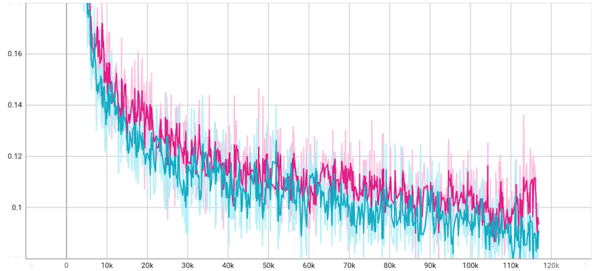

# midibert

Music Transformer をいじって事前学習モデルを作成

## トークン化

[PAD] 0  
[CLS] 1  
[MASK] 2  
[bar] 3 ← BERTの[SEP]  
[start] 4 ~ 51　(48)  
[duration] 52 ~ 67 (16)  
[pitch] 68 ~ 151 (84)  
[velocity] 152 ~ 167 (16)  

## 学習曲線

## 変更点

FFNの、ReLU → GELU  
[BAR] トークンを用いることで、次元数の削減  
